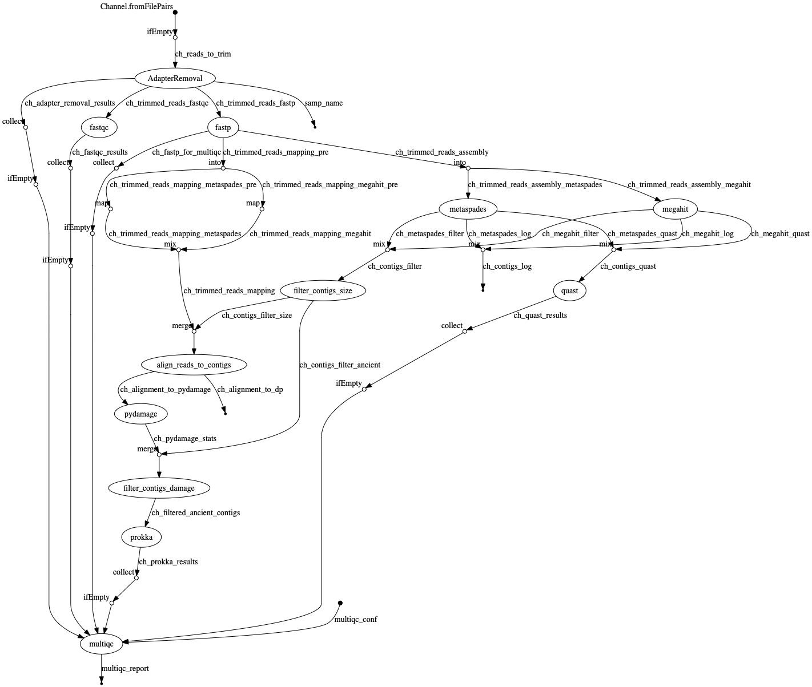

# 

**Metagenomic Assembly of Ancient DaMaged reads with Nextflow**.

[](https://github.com/nf-core/madman/actions)
[](https://github.com/nf-core/madman/actions)
[](https://www.nextflow.io/)

## Introduction

MADMAN is an assembly pipeline for ancient DNA.

MADMAN performs intial pre-processing of input FASTQ files. It then performs metagenomic _de novo_ assembly with one or multiple assemblers, runs assembly quality-control, and finally screens for potentially truly-ancient contigs through fitting of damage patterns to typical ancient DNA damage distributions.

It is built using [Nextflow](https://www.nextflow.io), a workflow tool to run tasks across multiple compute infrastructures in a very portable manner. It comes with docker containers making installation trivial and results highly reproducible.

## Quick Start

i. Install [`nextflow`](https://nf-co.re/usage/installation)

ii. Install either [`Docker`](https://docs.docker.com/engine/installation/) or [`Singularity`](https://www.sylabs.io/guides/3.0/user-guide/) for full pipeline reproducibility (please only use [`Conda`](https://conda.io/miniconda.html) as a last resort; see [docs](https://nf-co.re/usage/configuration#basic-configuration-profiles))

iii. Download the pipeline and test it on a minimal dataset with a single command

```bash
nextflow run nf-core/madman -profile test,<docker/singularity/conda/institute>
```

> Please check [nf-core/configs](https://github.com/nf-core/configs#documentation) to see if a custom config file to run nf-core pipelines already exists for your Institute. If so, you can simply use `-profile <institute>` in your command. This will enable either `docker` or `singularity` and set the appropriate execution settings for your local compute environment.

iv. Start running your own analysis!

<!-- TODO nf-core: Update the default command above used to run the pipeline -->

```bash
nextflow run nf-core/madman -profile <docker/singularity/conda/institute> --reads '*_R{1,2}.fastq.gz' --genome GRCh37
```

See [usage docs](docs/usage.md) for all of the available options when running the pipeline.

## Documentation

The nf-core/madman pipeline comes with documentation about the pipeline, found in the `docs/` directory:

1. [Installation](https://nf-co.re/usage/installation)
2. Pipeline configuration
    * [Local installation](https://nf-co.re/usage/local_installation)
    * [Adding your own system config](https://nf-co.re/usage/adding_own_config)
    * [Reference genomes](https://nf-co.re/usage/reference_genomes)
3. [Running the pipeline](docs/usage.md)
4. [Output and how to interpret the results](docs/output.md)
5. [Troubleshooting](https://nf-co.re/usage/troubleshooting)

<!-- TODO nf-core: Add a brief overview of what the pipeline does and how it works -->

## Credits

nf-core/madman was originally written by Maxime Borry.

## Contributions and Support

If you would like to contribute to this pipeline, please see the [contributing guidelines](.github/CONTRIBUTING.md).

For further information or help, don't hesitate to get in touch on [Slack](https://nfcore.slack.com/channels/madman) (you can join with [this invite](https://nf-co.re/join/slack)).

## Citation

<!-- TODO nf-core: Add citation for pipeline after first release. Uncomment lines below and update Zenodo doi. -->
<!-- If you use  nf-core/madman for your analysis, please cite it using the following doi: [10.5281/zenodo.XXXXXX](https://doi.org/10.5281/zenodo.XXXXXX) -->

You can cite the `nf-core` publication as follows:

> **The nf-core framework for community-curated bioinformatics pipelines.**
>
> Philip Ewels, Alexander Peltzer, Sven Fillinger, Harshil Patel, Johannes Alneberg, Andreas Wilm, Maxime Ulysse Garcia, Paolo Di Tommaso & Sven Nahnsen.
>
> _Nat Biotechnol._ 2020 Feb 13. doi: [10.1038/s41587-020-0439-x](https://dx.doi.org/10.1038/s41587-020-0439-x).  
> ReadCube: [Full Access Link](https://rdcu.be/b1GjZ)


## Help

```txt
$ nextflow run maxibor/madman --help
N E X T F L O W  ~  version 19.10.0
Launching `maxibor/madman` [maniac_hypatia] - revision: cf6cdbd49c
MADMAN: Metagenomic Assembly of Ancient DaMaged reads with Nextflow
 Homepage: https://github.com/maxibor/madman
 Author: Maxime Borry <borry@shh.mpg.de>
=========================================
Usage:
The typical command for running the pipeline is as follows:
nextflow run maxibor/madman --reads '/path/to/paired_end_reads_*.{1,2}.fastq.gz'
Mandatory arguments:
  --reads                           Path to input data (must be surrounded with quotes)

Settings:
  --phred                           Specifies the fastq quality encoding (33 | 64). Default: 33
  --single_end                      To specify if reads are single-end.
  --adapter_list                    List of sequencing adapters to trim. Default: /Users/borry/Documents/GitHub/madman/assets/adapter_list.txt
  --complexity_filter_poly_g_min    Length of poly-g min for clipping to be performed. Default: 10
  --minlen                          Minimum contig length to retain. Default:  300
  --minread                         Minimum number of reads aligned to contig to consider contig. Default: 150
  --wlen                            Window length from 5' end to consider for damage estimation. Default: 20
  --mindamage                       Mimimum amount of CtoT damage on the 5' end of the read. Default: 0.2
  --assembly_tool                   Choose de novo assembly tool, seperated by ',' (megahit | metaspades). Default: megahit


Options:
  --results                         The output directory where the results will be saved. Default: ./results
  --help  --h                       Shows this help page
```

## Workflow


